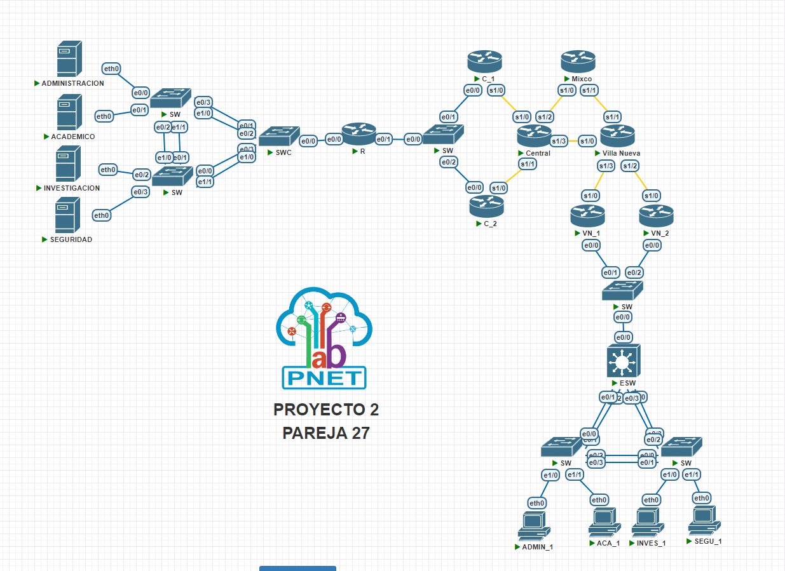

# Manual Técnico

## Sección 1: Navegando por las Direcciones IP 🖧

| Dispositivo ⚙️ | Direccion IP 🔍| Mascara de subred 🎭 | Puerta de enlace 🔗 |VLAN 📡|
|----------|------------|-----------------|-----------------|--------------|
| 🖥️ ACADEMICO | 172.127.2.1 | 255.255.255.224 | 172.127.2.30 | VLAN 127 |
| 🖥️ INVESTIGACION | 172.127.2.33 | 255.255.255.240 | 172.127.2.46 | VLAN 227 |
| 🖥️ ADMINISTRACION | 172.127.2.49 | 255.255.255.240 | 172.127.2.62 | VLAN 327 |
| 🖥️ SEGURIDAD | 172.127.2.65 | 255.255.255.248 | 172.127.2.70 | VLAN 427 |
| 💻 ACA_1 | 173.127.2.1 | 255.255.255.224 | 173.127.2.30 | VLAN 327 |
| 💻 SEGU_1 | 173.127.2.33 | 255.255.255.240 | 173.127.2.46 | VLAN 227 |
| 💻 INVES_1 | 173.127.2.49 | 255.255.255.240 | 173.127.2.62 | VLAN 527 |
| 💻 ADMIN_1 | 173.127.2.65 | 255.255.255.248 | 173.127.2.70 | VLAN 127 |

## Seccion 2: Redes

### Redes VLSM de Central

| Subred   | Nº de Hosts | ID de Red       | IP de red        | Máscara         | Primer Host   | Último Host   | Broadcast     | Puerta de enlace  |
|----------|------------|-----------------|-----------------|-----------------|--------------|--------------|--------------|-------------------|
| ACADEMICO | 30         | 172.127.2.0     | 172.127.2.0 /27 | 255.255.255.224 | 172.127.2.1  | 172.127.2.30 | 172.127.2.31 | 172.127.2.1       |
| INVESTIGACION | 14         | 172.127.2.32    | 172.127.2.32 /28| 255.255.255.240 | 172.127.2.33 | 172.127.2.46 | 172.127.2.47 | 172.127.2.33      |
| ADMINISTRACION | 14         | 172.127.2.48    | 172.127.2.48 /28| 255.255.255.240 | 172.127.2.49 | 172.127.2.62 | 172.127.2.63 | 172.127.2.49      |
| SEGURIDAD | 6          | 172.127.2.64    | 172.127.2.64 /29| 255.255.255.248 | 172.127.2.65 | 172.127.2.70 | 172.127.2.71 | 172.127.2.65      |

### Redes VLSM de Villa Nueva

| Subred   | Nº de Hosts | ID de Red       | IP de red        | Máscara         | Primer Host   | Último Host   | Broadcast     | Puerta de enlace  |
|----------|------------|-----------------|-----------------|-----------------|--------------|--------------|--------------|-------------------|
| ACADEMICO | 30         | 173.127.2.0     | 173.127.2.0 /27 | 255.255.255.224 | 173.127.2.1  | 173.127.2.30 | 173.127.2.31 | 173.127.2.1       |
| SEGURIDAD | 14         | 173.127.2.32    | 173.127.2.32 /28| 255.255.255.240 | 173.127.2.33 | 173.127.2.46 | 173.127.2.47 | 173.127.2.33      |
| INVESTIGACION | 14         | 173.127.2.48    | 173.127.2.48 /28| 255.255.255.240 | 173.127.2.49 | 173.127.2.62 | 173.127.2.63 | 173.127.2.49      |
| ADMINISTRACION | 6          | 173.127.2.64    | 173.127.2.64 /29| 255.255.255.248 | 173.127.2.65 | 173.127.2.70 | 173.127.2.71 | 173.127.2.65      |

## Sección 2: Topologia Implementada 🚀

